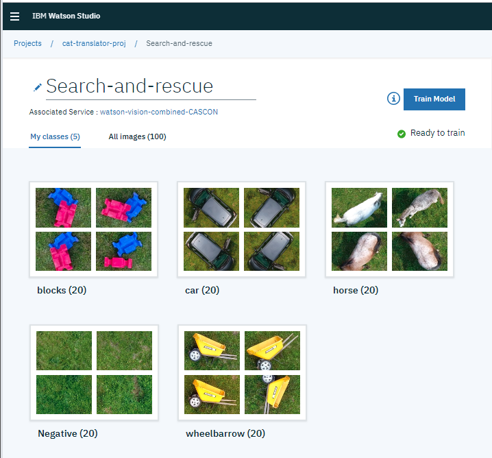
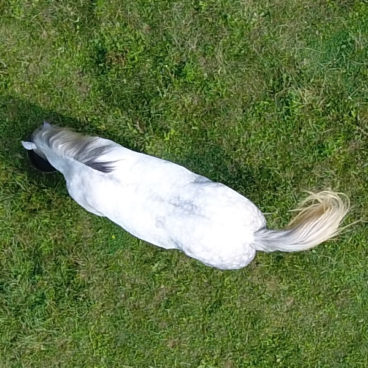
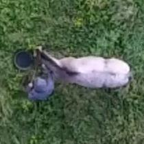
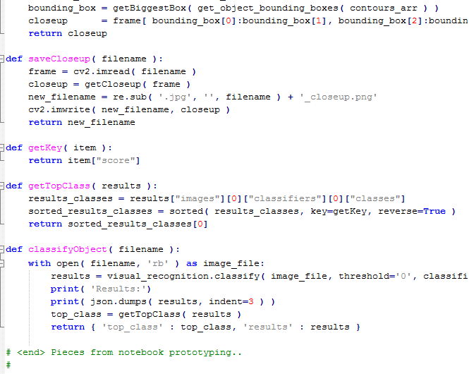

# IBM Cloud and Data Argentina 2019:
## Cómo puede Watson Studio ayudarte a rápidamente crear un prototipo de una solución de IA
### Una app de búsqueda y rescate

IBM Watson Studio tiene potentes capacidades de machine y deep learning. Pero sabías que también tiene herramientas simples para rápidamente entrenar y desplegar modelos de IA y para crear prototipos de aplicaciones?
Este ejemplo muestra cómo entrenar un modelo de reconocimiento visual utilizando el graphical model builder de Watson Studio. Luego, cómo crear una web app que use este modelo.

Este ejemplo explica cómo construir una web app que utiliza un modelo de visual recognition para clasificar imágenes obtenidas por drones:



Este ejemplo incluye:
- Imágenes para entrenamiento y prueba del modelo (capturas gráficas de un video obtenido desde un dron)
- Un Python notebook para probar el modelo 
- Otro Python notebook para crear el prototipo de la app
- El código de una Python Flask web app
- Instrucciones y videos que explican cómo entrenar y probar el modelo de reconocimiento de imágenes en [IBM Watson Studio](https://cloud.ibm.com/catalog/services/watson-studio), cómo ejecutar una web app desde tu computadora, y cómo desplegar esta web app en IBM Cloud.

Podés completar este ejemplo usando la versión gratuita (Lite) de estos servicios dentro de IBM Cloud:
- [IBM Cloud](https://cloud.ibm.com/registration)
- [IBM Watson Studio](https://cloud.ibm.com/catalog/services/watson-studio)
- [IBM Watson Visual Recognition](https://cloud.ibm.com/catalog/services/visual-recognition)
- [Python web app on IBM Cloud](https://cloud.ibm.com/catalog/starters/python) (free for 30 days)

<p>&nbsp;</p>

## Instrucciones
Estas instrucciones describen cómo construir la web app de ejemplo con las imágenes de entrenamiento y prueba.

<p>&nbsp;</p>


## Stage 1:

### Pre-requisitos

<ol>
<li><p>Crear una cuenta gratuita (Lite) en IBM Cloud (si ya tenés una cuenta creada, podés usar esa): <a href="https://www.ibm.com/cloud/">IBM Cloud sign up</a></p></li>
<li><p>Crear una instancia del servicio IBM Watson Studio en IBM Cloud: <a href="https://cloud.ibm.com/catalog/services/watson-studio">IBM Watson Studio</a></p></li>
<li><p>Crear un proyecto en Watson Studio:</p>
    <ol>
    <li>Ir a https://dataplatform.cloud.ibm.com y hacer log in (si es que ya no lo habías hecho antes)</li>
    <li>Hacer click en <b>New project</b>, seleccionar <b>Visual Recognition</b>, y luego seguir los pasos para asociar los servicios necesarios para el proyecto: IBM Cloud Object Storage e IBM Watson Visual Recognition.</li>
    </ol>
    <p>See also: <a href="https://dataplatform.cloud.ibm.com/docs/content/getting-started/projects.html">Creating projects</a></li>
<li><p>Para poder ejecutar la web app de ejemplo en tu computadora, <a href="https://www.python.org">instalá Python</a></p>
    <ul>
    <li>Asegurate que el instalador agregue Python a tus variables de entorno</li>
    <li>Para usuarios Mac, también instalar <code>pip</code> mediante este comando: <pre><code>sudo easy_install pip</code></pre></li>
    <li>Para usuarios Mac, también agregar la carpeta user base binary a tu path:
        <ol>
        <li>Encontrá la carpeta user base binary con este comando: <pre><code>python -m site --user-base</code></pre></li>
        <li>Agregá la carpeta sumándole <code>/bin</code> atrás, en el file <code>/etc/paths</code></li>
        </ol>
        <p>Revisá: <a href="https://www.architectryan.com/2012/10/02/add-to-the-path-on-mac-os-x-mountain-lion">Instrucciones detalladas</a></p></li>
    </ul></li>
<li>Para poder enviar la web app de ejemplo a IBM Cloud, <a href="https://console.bluemix.net/docs/cli/reference/ibmcloud/download_cli.html#install_use">instalá el IBM Cloud CLI</a></li>
</ol>

<p>&nbsp;</p>


### Paso 1: Colectar datos de entrenamiento y de prueba

1. <p>Desgargá estos cinco archivos .zip a tu computadora: <a href="sar-model/training_data">Datos de entrenamiento</a></p>
2. <p>Descargá estas cuatro imágenes a tu computadora: <a href="sar-model/test_images">Imágenes de prueba</a></p>

#### Sobre las imágenes de entrenamiento

Las imágenes de entrenamiento incluyen 20 fotos de cuatro objetos diferentes:

<table>
<tr>
  <td><b>Bloques</b><br/></td>
  <td><b>Auto</b><br/></td>
</tr>
<tr>
  <td><b>Caballo</b><br/></td>
  <td><b>Carretilla</b><br/></td>
</tr>
</table>

El archivo `_negative.zip` contiene imágenes sin objetos, para ser usado como clase negativa en el entrenamiento del modelo.

#### Sobre las imágenes de prueba

Las imágenes de prueba son cuatro fotos que no formaron parte del entrenamiento:

<table>
<tr>
  <td></td>
  <td></td>
  <td></td>
  <td></td>
</tr>
</table>

#### Sugerencias y comentarios
- <p>Con el servicio de IBM Watson Visual Recognition, podés usar imágenes tan chicas como 224 x 224 pixels sin experimentar una pérdida de performance. Por eso, pre-procesar imágenes de 224 x 224 puede hacerte la vida más fácil (por ejemplo, mejorando los tiempos de subida de los datos, frente a imágenes más grandes.)</p>
- <p>Las guías recomiendan usar al menos 50 imágenes de entrenamiento para cada clase. Sin embargo, si no tenés 50 imágenes, podés igualmente intentar entrenar el modelo con las fotos que tengas, y es probable que funcione correctamente. (Para nuestro ejemplo, hay 20 fotos de entrenamiento para cada clase)</p>
- <p>Incluir una clase negativa no es siempre requerido. Experimentá para determinar qué es lo que funciona mejor en tu caso particular. (Nuestro ejemplo incluye una clase negativa.)</p>

Ver: [IBM Watson Visual Recognition guidelines for good training](https://console.bluemix.net/docs/services/visual-recognition/customizing.html#customizing-guidelines-training)

<p>&nbsp;</p>


## Stage 2:

### Paso 2: Crear un modelo de reconocimiento visual dentro de tu proyecto en Watson Studio

1. <p>Hacé click en <b>Add to project</b> y luego click en <b>VISUAL RECOGNITION MODEL</b>.  Seguí los pasos para asociar una instancia del servicio IBM Visual Recognition a tu proyecto.  Esto abre el entrenador de reconocimiento visual.</p>
2. <p>Reemplazá el nombre "Default Custom Model" con el nombre que elijas.</p>
3. <p>En el panel de datos, arrastrá (o navegá hacia) los archivos .zip que descargaste en el paso 1.</p>
4. <p>En el panel de datos, seleccioná todos los archivos .zip y luego hacé click en <b>Add to model</b>.</p>
5. <p>Renombrá cada clase para remover el <code>.zip</code> del final del nombre.</p>
7. <p>Hacé click en <b>Train model</b>.</p>

También mirá: <a href="https://dataplatform.cloud.ibm.com/docs/content/analyze-data/visual-recognition-train.html">Entrenando un modelo de reconocimiento visual</a>

<p>&nbsp;</p>


### Paso 3: Probá el modelo en Watson Studio

1. <p>Cuando el entrenamiento esté completo, te va a aparecer un link a los detalles del modelo.  Hacé click en el link para ir a los detalles.  (Alternativamente, podés hacer click en el nombre del modelo dentro de la página de <b>Assets</b> de tu proyecto.)</p>
2. <p>Hacé click en la lengueta<b>Test</b>.</p>
3. <p>Descargá a tu computadora estas imágenes de prueba: <a href="sar-model/test_images">Imágenes de prueba</a></p>
4. <p>Arrastrá las imágenes de prueba hacia el área de clasificación.</p>

<p>&nbsp;</p>


### Paso 4: Trabajá con tu modelo entrenado desde un notebook en Watson Studio

**Nota:**  Ambos notebooks funcionan en el ambiente FREE Python 3.5 de Watson Studio.

#### 4.1

<ol>
<li><p>Agregá el primer notebook de ejemplo, <code>sar-test-notebook</code>, a tu proyecto:</p>
    <ol>
    <li>Hacé click en <b>Add to project</b> y después click en <b>NOTEBOOK</b></li>
    <li>Hacé click en la lengueta <b>From URL</b></li>
    <li>En el rectángulo llamado <b>Notebook URL</b>, pegá la URL de este notebook de ejemplo: <a href="sar-notebooks/sar-test-notebook.ipynb"><code>sar-test-notebook</code></a></li>
    <li>Dale un nombre al notebook</li>
    <li>Hacé click en Click <b>Create Notebook</b></li>
    </ol></li>
<li><p>Pegá en el notebook el ID y las credenciales de tu modelo:</p>
    <ol>
    <li>Desde el sub-menú <b>Services</b> dentro de la página principal, abrí <b>Watson Services</b> en una nueva lengueta</li>
      <li>Al lado de tu instancia de IBM Watson Visual Recognition service, hacé click en <b>Launch tool</b></li>
      <li>En la lengueta <b>Overview</b>, bajá hasta encontrar el modelo que creaste en el paso 2, y luego copiá el ID del modelo</li>
      <li>Pegá el ID del modelo en el notebook en el espacio indicado</li>
      <li>Volviendo a la lengueta de <b>Credentials</b> dentro de la herramienta de Visual Recognition, creá unas credenciales de prueba y luego copiá la <code>apikey</code></li>
      <li>Pegá la apikey en el notebook en el espacio indicado</li>
    </ol></li>
<li><p>Leé, explorá y ejecutá las celdas del notebook de ejemplo.  Aprendé cómo usar el cliente Python de Watson Visual Recognition para clasificar imágenes de prueba.</p></li>
</ol>

#### 4.2

Repetí el paso 4.1 con el segundo notebook de ejemplo, <a href="sar-notebooks/sar-app-code-notebook.ipynb"><code>sar-app-code-notebook</code></a>.

En este notebook, vas a ver cómo definir algunas funciones que vas a precisar dentro de la Python web app de ejemplo.

También mirá:
- [Notebooks en Watson Studio](https://dataplatform.cloud.ibm.com/docs/content/analyze-data/notebooks-parent.html)
- [IBM Watson Visual Recognition API](https://cloud.ibm.com/apidocs/visual-recognition?code=python)

<p>&nbsp;</p>


## Stage 3:

### Paso 5: Copiá el prototipo dentro de una app web

1. <p>Descargá y descomprimí la app de ejemplo desde este link: <a href="sar-web-app/sar-web-app.zip">Sample Python Flask web app</a></p>
2. <p>En el archivo <code>server.py</code>, pegá tu ID de modelo y las credenciales (como hiciste en el notebook de ejemplo)</p>
3. <p>Notá que las funciones <code>getKey</code>, <code>getTopClass</code>, y <code>classifyObject</code> que fueron prototipadas en el notebook, son usadas en el archivo <code>server.py</code></p></a>

#### Archivos dentro de la app
<table>
<tr>
  <th>Archivo</th>
  <th>Descripción</th>
</tr>
<tr>
  <td><code>server.py</code></td>
  <td>Código Python Flask para ejecutar del lado del server en nuestra app</td>
</tr>
<tr>
  <td><code>static/index.html</code></td>
  <td>HTML y Javascript (AJAX) para la interfaz web de la app</td>
</tr>
<tr>
  <td><code>static/css/styles.css</code></td>
  <td>Controla la apariencia de la página web</td>
</tr>
</table>

<p>&nbsp;</p>


### Paso 6: Corré la app en tu computadora local

1. Abrí una línea de comandos y navegá a la carpeta que contiene el archivo <code>server.py</code>
2. Instalá las dependencias:
    ```
    pip install -r requirements.txt
    ```
    Usuarios Mac, correr este comando en lugar del anterior:
    ```
    pip install --user -r requirements.txt
    ```
3. Desde la línea de comandos, iniciá el Python Flask server con este comando: <pre><code>python server.py</code></pre>
4. Abrí este link en un navegador web: [http://localhost:8000/](http://localhost:8000)
5. Clasificá alguna de las imágenes de prueba

<p>&nbsp;</p>


### Paso 7: Desplegá la app en la nube pública de IBM

<ol>
  <li><p>En IBM Cloud, creá una Python Flask Cloud Foundry app, con tamaño de 128 MB: <a href="https://console.bluemix.net/catalog/starters/python">Python Flask starter app</a></p></li>
  <li><p>En el archivo local <code>manifest.yml</code>, reemplazá <code>app-name</code> por el nombre que le diste a la app cuando creaste el Python Flask app starter:
<pre><code>applications:
- name: app-name
  memory: 128M
</code></pre></p></li>
<li><p>En el archivo local <code>setup.py</code>, reemplazá <code>app-name</code> por el mismo nombre de app del paso anterior:
<pre><code>setup(
    name='app-name',
    version='1.0.0',
...
</code></pre></p></li>
  <li><p>En la línea de comandos, hacé login en tu cuenta IBM Cloud account con este comando:
<pre><code>ibmcloud login
</code></pre></p></li>
  <li><p>En la línea de comandos, apuntá al CloudFoundry API endpoint con este comando:
<pre><code>ibmcloud target --cf
</code></pre></p></li>
  <li><p>En la línea de comandos, desde la carpeta donde está la app (donde está el archivo server.py)
enviá tu app a IBM Cloud con este comando:
<pre><code>ibmcloud app push
</code></pre></p></li>
</ol>

<p>&nbsp;</p>


=======
<hr>
<p>Copyright © 2019 IBM. This tutorial and its source code are released under the terms of the MIT License.</p>
